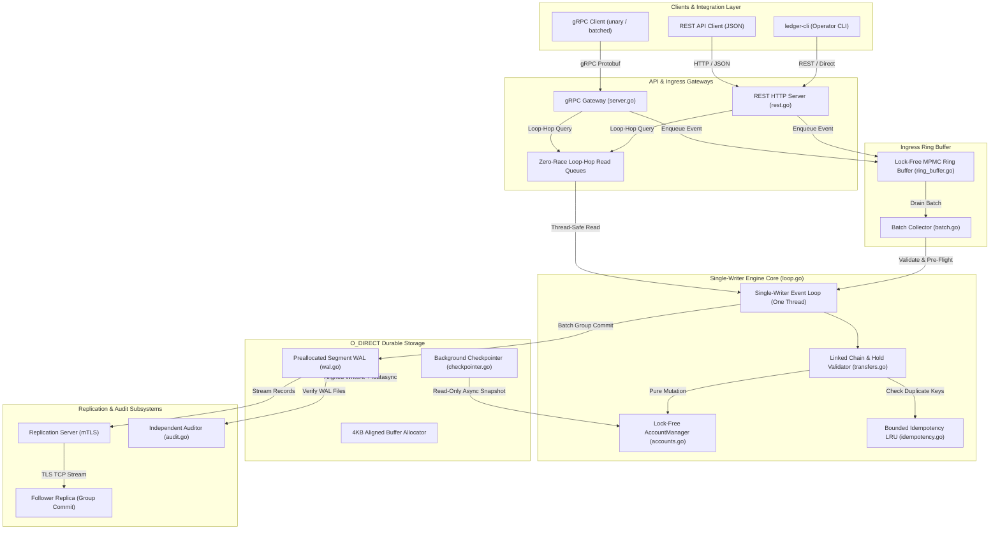
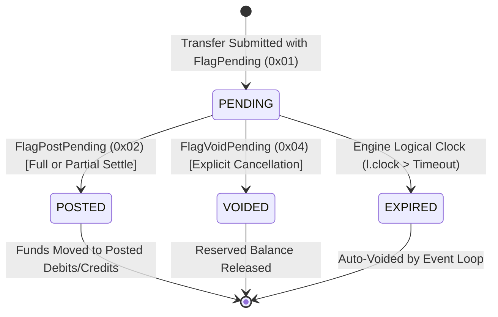
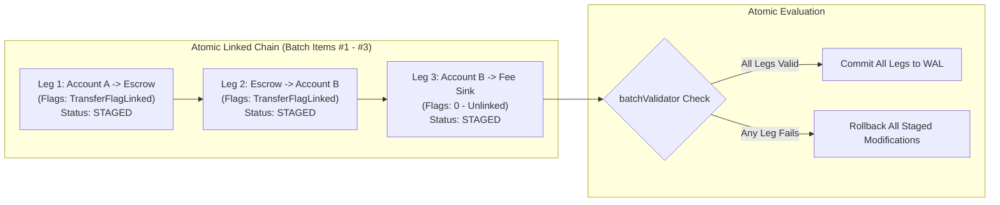
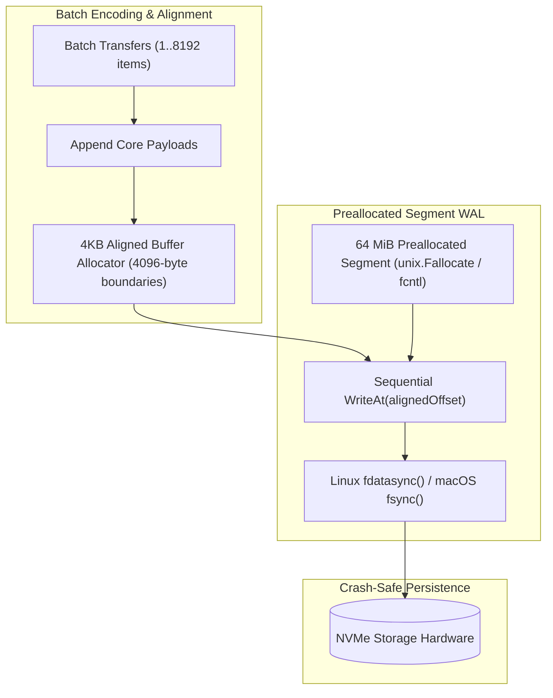
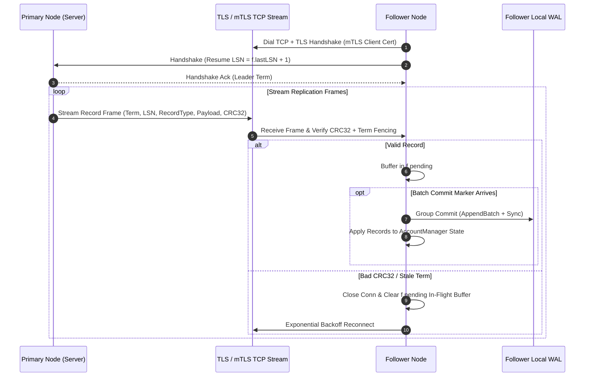

<div align="center">

# ⚡ aequitas-ledger

> **Single-Writer Event Loop. O_DIRECT Group-Commit WAL. Strict Double-Entry Invariants.**

[](https://go.dev/)
[](Makefile)
[](Makefile)
[](tests/)
[](tests/)
[](docs/benchmark_report.md)
[](proto/ledger/v1/ledger.proto)
[](internal/replication/)
[](LICENSE)

*A high-throughput, crash-safe, single-writer double-entry financial ledger in Go inspired by **TigerBeetle** — featuring 4KB-aligned direct I/O preallocation, two-phase holds, linked transfer chains, multi-tenant isolation, batch-synchronous timestamps, streaming replication with mTLS, and an independent WAL auditor.*

[📖 Architecture Guide](docs/Status.md) • [🚀 Quick Start](#-quick-start--local-deployment) • [⚡ Benchmark Report](docs/benchmark_report.md) • [🧪 Testing & Verification](#-concurrency-benchmark--testing-suite) • [🔐 API Reference Matrix](#-api-reference-matrix) • [📜 Technical Roadmap](docs/ROADMAP.md)

</div>

---

## 📌 Summary & System Vision

**`aequitas-ledger`** is an enterprise-grade financial accounting ledger engineered for high-throughput payment infrastructure, card authorization holds, multi-tenant balances, and settlement engines where financial correctness cannot be compromised.

In high-volume transaction processing, traditional relational databases using single-column balance updates (`UPDATE accounts SET balance = balance - amount WHERE id = ...`) introduce catastrophic operational failure modes under heavy concurrency:
- **Row Lock Contention & Throughput Collapse:** High-frequency hot accounts (e.g., central clearing accounts or merchant settlement nodes) cause database connection pool exhaustion and severe p99/p99.9 latency spikes.
- **Floating-Point & Rounding Inaccuracies:** Using standard IEEE floating-point math or unconstrained numeric columns introduces silent micro-rounding drifts across millions of journal postings.
- **Non-Deterministic State Machine Replay:** Unordered multi-threaded SQL execution causes primary database instances and read-replicas to diverge after system crashes or point-in-time recovery.
- **Double-Buffering & Disk Stall Latency:** OS filesystem page-cache double buffering and metadata write locks cause unpredictable write stalls during crash-flush operations.
- **Partial Batch Failures & Unchecked Overdrafts:** Uncoordinated API calls reserve or transfer partial multi-leg payments without atomic all-or-nothing rollback capabilities.

**`aequitas-ledger` eliminates these systemic vulnerabilities** by implementing a pure single-writer architecture in Go inspired by TigerBeetle:
1. **Single-Writer Event Loop:** A dedicated thread owns all mutable in-memory balance states, eliminating mutex locks, row-level database locks, and thread contention.
2. **O_DIRECT Group-Commit WAL:** Direct I/O preallocated segment files with 4KB page alignment eliminate double buffering and aggregate thousands of incoming transfers into single disk flushes (`fdatasync`).
3. **128-Bit Precision & Fixed Memory Layouts:** Custom 128-bit unsigned integer arithmetic (`core.Uint128`) backed by byte-exact 128-byte `Account` and 144-byte `Transfer` structs with compile-time layout guards.
4. **Two-Phase Holds & Logical Clock Expiry:** Complete pending reserve (`FlagPending`), settlement (`FlagPostPending`), and cancellation (`FlagVoidPending`) lifecycle with deterministic, batch-synchronous logical clock timeouts.
5. **Linked Transfer Chains (`flag_linked`):** Atomic all-or-nothing execution across multi-leg transfer sequences with staged balance visibility and automatic rollback.
6. **Multi-Tenant Partitioning (`ledger`):** strict multi-tenant isolation enforcing zero cross-ledger transfers and independent per-tenant double-entry conservation auditing ($\sum \text{Credits} - \sum \text{Debits} = \text{InjectedCredits}$).
7. **Streaming Replication & Term Fencing:** Real-time TCP journal replication with leader term fencing, exponential backoff circuit breakers, and TLS/mTLS mutual authentication.

---

## 📑 Table of Contents

1. [Executive Summary & System Vision](#-summary--system-vision)
2. [System Architecture & Dataflow](#-system-architecture--dataflow)
3. [Double-Entry Accounting & Memory Layouts](#-double-entry-accounting--memory-layouts)
4. [Two-Phase Holds & Logical Clock Expiry (D1.2)](#-two-phase-holds--logical-clock-expiry-d12)
5. [Linked Transfer Chains (`flag_linked` - D1.3)](#-linked-transfer-chains-flag_linked---d13)
6. [Multi-Tenant Partitioning & Rich Schema (D1.4)](#-multi-tenant-partitioning--rich-schema-d14)
7. [Batch-Synchronous Timestamp Discipline (D1.6)](#-batch-synchronous-timestamp-discipline-d16)
8. [O_DIRECT Storage Engine & Preallocation (S2.2)](#-o_direct-storage-engine--preallocation-s22)
9. [Streaming Replication, Term Fencing & TLS (C0.8 / P5.3)](#-streaming-replication-term-fencing--tls-c08--p53)
10. [Independent WAL Auditor & Fault Injection (T3.2 / T3.4)](#-independent-wal-auditor--fault-injection-t32--t34)
11. [Repository Structure & ADR Index](#-repository-structure--adr-index)
12. [Quick Start & Local Deployment](#-quick-start--local-deployment)
13. [Concurrency Benchmark & Testing Suite](#-concurrency-benchmark--testing-suite)
14. [API Reference Matrix](#-api-reference-matrix)
15. [License & Compliance](#-license--compliance)

---

## 🏗 System Architecture & Dataflow



---

## 🏦 Double-Entry Accounting & Memory Layouts

`aequitas-ledger` strictly prohibits destructive or single-column balance updates. Account balances are tracked via four explicit balance fields: `PostedDebits`, `PostedCredits`, `PendingDebits`, and `PendingCredits`.

### 1. Atomic Transaction Journal Posting Sequence

```mermaid
sequenceDiagram
    autonumber
    participant Client as Client Application / API
    participant Ring as MPMC Ring Buffer
    participant Loop as Single-Writer Event Loop
    participant Val as batchValidator (transfers.go)
    participant Acc as AccountManager (In-Memory)
    participant Disk as O_DIRECT WAL (wal.go)

    Client->>Ring: Enqueue Transfer Batch (TransferEvent)
    Ring->>Loop: DrainBatch(max=8192)
    Loop->>Loop: Assign Batch-Synchronous Monotonic Timestamp
    Loop->>Val: Validate Batch & Linked Chains (validateAndApply)
    
    alt Any Chain Validation or Balance Check Fails
        Val-->>Loop: Rollback Chain Staged State & Return Error
        Loop-->>Client: Ack Batch Outcomes (ErrLinkedChainFailed / Insufficient Funds)
    else All Checks Pass
        Val->>Acc: Apply Staged Balance Mutations (No Locks)
        Loop->>Disk: WAL AppendBatch() + Single Sync() (Group Commit)
        Disk-->>Loop: Durable Disk Sync Confirmation (fdatasync)
        Loop-->>Client: Ack Batch Outcomes (OK + Committed Transfer Records)
    end
```

### 2. Mathematical Invariant Equations

Every committed transaction MUST satisfy the double-entry zero-sum invariant strictly per ledger partition:

$$\sum \text{CREDITS}_{\text{ledger}} - \sum \text{DEBITS}_{\text{ledger}} = \sum \text{INJECTED}_{\text{ledger}}$$

Account balances are dynamically evaluated from value fields:

$$\text{Posted Balance} = \text{PostedCredits} - \text{PostedDebits}$$

$$\text{Available Balance} = (\text{PostedCredits} + \text{PendingCredits}) - (\text{PostedDebits} + \text{PendingDebits})$$

```text
┌─────────────────────────────────────────────────────────────────────────┐
│ 🔍 [BEHIND THE SCENES ENGINE ARCHITECTURE: ZERO-MUTEX MUTATION]          │
│                                                                         │
│   1. The Event Loop thread is the SOLE writer to AccountManager.        │
│   2. Zero sync.Mutex or sync.RWMutex calls exist in the execution path. │
│   3. Accounts are stored as naturally aligned 128-byte value structs.   │
│   4. Read queries hop into the event loop thread via lock-free queues,   │
│      preventing data races under go test -race.                         │
└─────────────────────────────────────────────────────────────────────────┘
```

### 3. 128-Bit Money Arithmetic & Memory Alignment

Financial amounts use `core.Uint128` (composed of two `uint64` fields `Lo` and `Hi`), supporting values up to $2^{128}-1$ ($\approx 3.4 \times 10^{38}$) with full bitwise overflow and underflow checks. Memory layouts are fixed and asserted at compile time:

- **`Account` Struct Layout (128 Bytes):**
  ```go
  type Account struct {
      ID             [16]byte  // 16 bytes: 128-bit UUID / Account ID
      Currency       [4]byte   //  4 bytes: ISO-4217 / Crypto Currency Code
      Ledger         uint32    //  4 bytes: Multi-tenant Ledger Partition ID
      Code           uint16    //  2 bytes: Chart of Accounts categorizer
      _              [2]byte   //  2 bytes: Explicit padding alignment
      Flags          uint32    //  4 bytes: Status flags (1=Frozen, 2=Closed)
      UserData128    [16]byte  // 16 bytes: Client correlation metadata
      PostedDebits   Uint128   // 16 bytes: Total posted debits
      PostedCredits  Uint128   // 16 bytes: Total posted credits
      PendingDebits  Uint128   // 16 bytes: Total pending debit holds
      PendingCredits Uint128   // 16 bytes: Total pending credit holds
      _              [16]byte  // 16 bytes: Reserved expansion padding
  }
  // Compile-time assertion guard:
  const _ = uint(128 - unsafe.Sizeof(Account{}))
  ```

- **`Transfer` Struct Layout (144 Bytes):**
  ```go
  type Transfer struct {
      ID              [16]byte // 16 bytes: Transfer ID
      DebitAccountID  [16]byte // 16 bytes: Debit Account ID
      CreditAccountID [16]byte // 16 bytes: Credit Account ID
      Amount          Uint128  // 16 bytes: Transfer Amount
      IdempotencyKey  [32]byte // 32 bytes: SHA-256 Idempotency Key
      UserData128     [16]byte // 16 bytes: Client correlation metadata
      Timestamp       int64    //  8 bytes: Batch-synchronous nanoseconds
      Timeout         uint64   //  8 bytes: Hold timeout in nanoseconds
      Ledger          uint32   //  4 bytes: Multi-tenant Ledger Partition ID
      Code            uint16   //  2 bytes: Transfer classification code
      _              [2]byte  //  2 bytes: Explicit padding alignment
      Flags           uint32   //  4 bytes: Transfer flags (1=Pending, 2=Post, 4=Void, 8=Linked)
      _              [4]byte  //  4 bytes: Struct trailing padding
  }
  // Compile-time assertion guard:
  const _ = uint(144 - unsafe.Sizeof(Transfer{}))
  ```

---

## ⚙️ Two-Phase Holds & Logical Clock Expiry (D1.2)

Two-phase transfers support card payment authorizations, merchant holds, and escrow reservation lifecycle flows.



### State Transition & Execution Rules

| Initial State | Requested Flag | Condition / Requirement | Outcome / Balance Effect |
|---|---|---|---|
| Non-existent | `TransferFlagPending (0x01)` | `AvailableBalance(debit) >= Amount` | Reserves `Amount` in `debit.PendingDebits` & `credit.PendingCredits` |
| `PENDING` | `TransferFlagPostPending (0x02)` | `Amount <= Pending.Amount` (or `Amount == 0` for full) | Moves settled `Amount` to `PostedDebits`/`PostedCredits`, releases remaining hold |
| `PENDING` | `TransferFlagVoidPending (0x04)` | Pending transfer ID exists | Decrements `PendingDebits` & `PendingCredits`, releasing reserved funds |
| `PENDING` | Automatic Timeout | Engine clock `l.clock > Timeout` | Engine auto-voids hold deterministically across all nodes |

```text
┌─────────────────────────────────────────────────────────────────────────┐
│ 🔍 [BEHIND THE SCENES ENGINE ARCHITECTURE: BATCH-DETERMINISTIC EXPIRY]  │
│                                                                         │
│   1. The Event Loop tracks a strictly monotonic clock (l.clock).        │
│   2. Pending holds with Timeout > 0 are evaluated every batch iteration.│
│   3. Expired holds trigger synthetic void events within the loop.       │
│   4. Replay from WAL and follower nodes process identical timeouts,     │
│      preventing primary/secondary state divergence.                     │
└─────────────────────────────────────────────────────────────────────────┘
```

---

## 🔗 Linked Transfer Chains (`flag_linked` - D1.3)

Multi-leg payment flows (e.g., Account A $\to$ USD Escrow $\to$ EUR Escrow $\to$ Account B) require atomic all-or-nothing execution across sequence chains.



### Linked Chain Atomicity & Boundary Fencing Rules
1. **Staged Balance Visibility:** Later legs in a linked chain observe the staged balance changes of earlier legs in the same chain, allowing zero-balance intermediate escrow accounts to transfer funds immediately.
2. **All-or-Nothing Rollback:** If any leg in a linked chain fails (e.g., frozen account, balance overflow, invalid currency), the validator rolls back all staged account states using backward journal snapshots (`accountSnapshot`, `pendingSnapshot`).
3. **Error Reporting:** The failing transfer receives its specific typed error (e.g., `ErrInsufficientFunds`), while all other transfers in the chain return `core.ErrLinkedChainFailed{FailedTransferID, Index}`. Zero WAL records are written for failed chains.
4. **Dangling Open Chain Prevention:** If the final transfer in a batch has `TransferFlagLinked` set, it cannot be completed in that batch. The engine rejects it with `core.ErrLinkedChainOpen`, rolling back any prior legs.

---

## 🏢 Multi-Tenant Partitioning & Rich Schema (D1.4)

`aequitas-ledger` supports multi-tenant isolation and accounting chart-of-accounts classification:

- **Multi-Tenant Isolation (`Ledger uint32`):** Accounts belong to explicit ledger partition IDs (e.g., `Ledger 100` for Organization A, `Ledger 200` for Organization B). Cross-tenant transfers (`debit.Ledger != credit.Ledger` or `transfer.Ledger != account.Ledger`) are rejected at validation with `core.ErrLedgerMismatch`.
- **Chart of Accounts Categorizer (`Code uint16`):** Classifies account and transfer categories (e.g., `1000` = Liquid Asset, `2000` = Liability, `5000` = Operating Expense).
- **Client Correlation Token (`UserData128 [16]byte`):** 128-bit uninterpreted correlation payload stored in the WAL, persisted in snapshots, and returned in all API responses verbatim.

```text
┌─────────────────────────────────────────────────────────────────────────┐
│ 🔍 [BEHIND THE SCENES ENGINE ARCHITECTURE: PER-LEDGER AUDITING]         │
│                                                                         │
│   The independent auditor (internal/audit/audit.go) groups accounts     │
│   and transfers strictly by Ledger uint32.                              │
│   Conservation is audited independently per tenant:                     │
│     SUM(Credits_L) - SUM(Debits_L) == InjectedCredits_L                 │
└─────────────────────────────────────────────────────────────────────────┘
```

---

## ⏱ Batch-Synchronous Timestamp Discipline (D1.6)

To prevent clock drift between transfers inside a single batch and guarantee exact replay determinism:

1. **Single Clock Sampling:** The system clock (`time.Now().UnixNano()`) is sampled **once** per batch boundary in `EventLoop.processBatch`.
2. **Strict Monotonicity:** If `now <= l.clock`, the timestamp is set to `l.clock + 1`.
3. **Batch Uniformity:** All valid transfers within a batch receive the identical nanosecond timestamp.
4. **Replay Preservation:** The timestamp is durably written into the WAL payload; follower nodes and crash recovery loops read the timestamp directly without re-evaluating system clocks.

---

## 💾 O_DIRECT Storage Engine & Preallocation (S2.2)

The storage engine (`internal/wal/`) is engineered to eliminate filesystem metadata write locks and OS page-cache double buffering.



### Key Storage Optimizations
1. **OS Segment Preallocation:** Segments are preallocated to 64 MiB (`unix.Fallocate` with `FALLOC_FL_KEEP_SIZE` on Linux; `fcntl(F_PREALLOCATE)` on macOS), eliminating OS extent allocation latency during write operations.
2. **Aligned Direct I/O (`O_DIRECT`):** Allocates memory buffers aligned to 4096-byte boundaries (`NewAlignedBuffer`). Writes execute via `O_DIRECT` blocks, bypassing OS cache layer double buffering.
3. **CRC32-IEEE Verification:** Every record frame carries an IEEE CRC32 checksum over header and payload (`RecordHeaderSize + RecordCRCSize`), verified on recovery and replication streaming.

---

## 🔄 Streaming Replication, Term Fencing & TLS (C0.8 / P5.3)

`aequitas-ledger` includes high-availability streaming replication for primary-follower clustering:



### Replication Architecture Features
- **Follower Group Commit:** Follower buffers streaming data records until the primary's `RecordTypeBatchCommit` frame arrives, executing a single `AppendBatch` + `Sync` flush to local disk.
- **Leader Term Fencing:** Primary streams its election term; followers reject frames with `term < lastTerm` without triggering state resets, preventing split-brain corruption.
- **Circuit Breaker & Clean Re-sync:** After 8 consecutive network or CRC failures, the follower trips its circuit breaker, wipes local state, and re-synchronizes cleanly from LSN 1 (`WAL.Reset()`).
- **Reconnection Buffer Cleanup:** Disconnection or stream errors automatically clear `f.pending`, preventing uncommitted records from being duplicated when the primary re-streams from `lastLSN + 1`.
- **TLS / mTLS Encryption (P5.3):** Full TLS/mTLS mutual authentication configured via `REPLICATION_TLS_ENABLED`, `REPLICATION_TLS_CERT`, `REPLICATION_TLS_KEY`, and `REPLICATION_TLS_CA`.

---

## 🔍 Independent WAL Auditor & Fault Injection (T3.2 / T3.4)

Durability guarantees are verified via standalone offline auditing and hardware fault injection tools:

- **Independent WAL Auditor (`cmd/ledger-cli audit`):**
  - Re-implements segment parsing, frame decoding, CRC checking, batch commit validation, LSN monotonicity, and per-ledger balance conservation in a clean codebase sharing zero engine state.
  - Usage: `ledger-cli audit --wal <path-to-wal-dir>`.
- **Fault Injection Framework (`internal/wal/fault_injector.go`):**
  - Injects simulated hardware failures: bit flips in headers/payloads/CRCs (`FlipBit`), byte corruption (`CorruptBytes`), and torn writes (`TornWrite`).
  - Asserts that crash recovery detects corrupted frames, halts cleanly at the last valid committed batch prefix, and returns typed errors without silent data corruption.

---

## 📁 Repository Structure & ADR Index

```
aequitas-ledger/
├── cmd/
│   ├── server/                        # Server entry point (gRPC, REST, Checkpointer, TLS)
│   │   └── main.go
│   ├── ledger-cli/                    # Operator CLI tool (accounts, transfers, audit)
│   │   └── main.go
│   └── bench/                         # Standalone benchmark runner
│       └── main.go
│
├── proto/
│   └── ledger/v1/
│       ├── ledger.proto               # Protobuf service & message definitions
│       ├── ledger.pb.go               # Generated Go protobuf stubs
│       └── ledger_grpc.pb.go          # Generated Go gRPC stubs
│
├── internal/
│   ├── core/                          # Domain primitives & byte-exact codecs
│   │   ├── uint128.go                 # 128-bit unsigned integer arithmetic
│   │   ├── account.go                 # 128-byte Account value struct & flags
│   │   ├── transfer.go                # 144-byte Transfer value struct & flags
│   │   ├── codec.go                   # Fixed-size binary payload serializers
│   │   └── errors.go                  # Typed ledger error definitions
│   │
│   ├── engine/                        # Core state machine & single-writer loop
│   │   ├── loop.go                    # THE single-writer event loop goroutine
│   │   ├── transfers.go               # Linked-chain batch validator & hold engine
│   │   ├── accounts.go                # AccountManager (pure value mutations, 0 locks)
│   │   ├── ring_buffer.go             # Lock-free MPMC submission ring buffer
│   │   ├── batch.go                   # Batch collector & countdown synchronization
│   │   ├── idempotency.go             # IdempotencyStore (LRU + TTL eviction)
│   │   └── ledger.go                  # High-level engine interface & loop-hop queues
│   │
│   ├── wal/                           # O_DIRECT Durable Write-Ahead Log
│   │   ├── wal.go                     # WAL manager, AppendBatch, Sync, Truncate
│   │   ├── segment.go                 # Preallocated fixed-size segment files
│   │   ├── record.go                  # Frame encoding: [header|payload|crc32]
│   │   ├── prealloc_linux.go          # Linux unix.Fallocate preallocation
│   │   ├── prealloc_darwin.go         # macOS fcntl(F_PREALLOCATE) preallocation
│   │   └── fault_injector.go          # Hardware fault injection testing tool
│   │
│   ├── replication/                   # Primary-Follower streaming replication
│   │   ├── server.go                  # Primary replication TCP server (TLS/mTLS)
│   │   └── follower.go                # Follower synchronization loop & breaker
│   │
│   ├── snapshot/                      # Async background checkpointer
│   │   ├── checkpointer.go            # Background snapshot writer loop
│   │   └── snapshot.go                # LEDGER03 binary snapshot encoder
│   │
│   ├── audit/                         # Independent offline WAL auditor
│   │   └── audit.go                   # Standalone invariant & conservation verifier
│   │
│   ├── api/                           # Transport gateways
│   │   ├── server.go                  # gRPC server implementation
│   │   └── rest.go                    # REST HTTP gateway implementation
│   │
│   ├── config/                        # System environment configuration
│   │   └── config.go
│   └── observability/                 # Prometheus metrics & pprof
│       └── metrics.go
│
├── tests/
│   ├── unit/                          # Unit & codec benchmarks
│   │   ├── codec_test.go              # Struct size & zero-alloc codec tests
│   │   ├── uint128_test.go            # 128-bit math unit tests
│   │   └── wal_test.go                # WAL segment & CRC tests
│   │
│   └── integration/                   # Integration & correctness suite
│       ├── linked_transfers_test.go   # Linked chain atomic execution tests
│       ├── multi_ledger_test.go       # Multi-tenant isolation & audit tests
│       ├── batch_timestamp_test.go    # Batch-synchronous timestamp tests
│       ├── two_phase_query_test.go    # Two-phase hold & query API tests
│       ├── replication_adversarial_test.go # Chaos proxy network tests
│       ├── fault_injection_test.go    # Bit-flip & corruption recovery tests
│       └── crash_property_test.go     # Truncation-offset sweep tests
│
├── deploy/                            # Production & cluster manifests
│   ├── docker-compose.yml             # Primary + Follower + Prometheus + Grafana
│   └── prometheus.yml                 # Metrics scraping config
│
├── docs/                              # Project documentation & ADRs
│   ├── Status.md                      # Authoritative status & verification matrix
│   ├── ROADMAP.md                     # Technical roadmap & implementation status
│   ├── benchmark_report.md            # Empirical performance report vs Postgres
│   └── adr/                           # Architecture Decision Records (001–006)
│
├── Makefile                           # Development & CI targets
└── go.mod                             # Go module definition
```

### Architectural Decision Records (ADRs)

| ADR | Title | Key Architectural Choice | Status |
|---|---|---|---|
| [ADR-001](docs/adr/001-single-writer-event-loop.md) | Single-Writer Event Loop | Single goroutine owns all mutable state; eliminates mutexes in execution path | Accepted |
| [ADR-002](docs/adr/002-group-commit-wal.md) | WAL Group Commit | Aggregates transfers into single sequential disk flush (`fdatasync`) per batch | Accepted |
| [ADR-003](docs/adr/003-uint128-money-type.md) | 128-Bit Money Representation | `core.Uint128` unsigned integer arithmetic eliminating floating-point errors | Accepted |
| [ADR-004](docs/adr/004-deterministic-batch-ordering.md) | Deterministic Batch Execution | Flat slice iteration across engine batches ensuring identical replay order | Accepted |
| [ADR-005](docs/adr/005-idempotency-eviction.md) | Bounded Idempotency Eviction | LRU ring buffer with TTL expiration preventing memory leak vectors | Accepted |
| [ADR-006](docs/adr/006-snapshot-checkpointer.md) | Asynchronous Snapshot Checkpointer | Background snapshot creation without pausing event loop write path | Accepted |

---

## ⚡ Quick Start & Local Deployment

### Prerequisites
- **Go**: Version 1.22 or higher
- **Make**: Standard build automation
- **Docker & Docker Compose** (Optional for container stack)

### 1. Build Binaries Locally
```bash
# Clone repository
git clone https://github.com/0xshikhar/aequitas-ledger.git
cd aequitas-ledger

# Verify zero-panic rule across internal codebase
make panic-gate

# Build server and operator CLI binaries
go build -o bin/server ./cmd/server
go build -o bin/ledger-cli ./cmd/ledger-cli
```

### 2. Run Single Node Engine
```bash
# Start server in standalone primary mode
./bin/server
```

### 3. Execute Operations via CLI
```bash
# Create Account #1 (Ledger 100, USD, Initial Credits 10,000)
./bin/ledger-cli account create \
  -id 00000000000000000000000000000001 \
  -currency USD \
  -ledger 100 \
  -initial-credits 10000

# Create Account #2 (Ledger 100, USD)
./bin/ledger-cli account create \
  -id 00000000000000000000000000000002 \
  -currency USD \
  -ledger 100

# Post Transfer (Account #1 -> Account #2: 2,500 USD)
./bin/ledger-cli transfer create \
  -id 00000000000000000000000000000101 \
  -debit 00000000000000000000000000000001 \
  -credit 00000000000000000000000000000002 \
  -amount 2500 \
  -ledger 100

# Inspect Account Balance
./bin/ledger-cli account get -id 00000000000000000000000000000001
```

### 4. Run Turnkey Docker Compose Cluster
Launch Primary Engine, Follower Replica, Prometheus, and Grafana:
```bash
docker compose -f deploy/docker-compose.yml up --build
```
- **REST API:** `http://localhost:8080`
- **gRPC API:** `localhost:50051`
- **Prometheus Metrics:** `http://localhost:9090`
- **Grafana Dashboard:** `http://localhost:3000` (admin/admin)

---

## 🧪 Concurrency Benchmark & Testing Suite

### Empirical Performance Summary (vs Postgres Baseline)

Full benchmark methodology and pprof analysis available in [docs/benchmark_report.md](docs/benchmark_report.md).

| Workload Configuration | Architecture Mode | Measured Throughput (TPS) | Mean Latency | Speedup Factor |
|---|---|---|---|:---:|
| **Postgres Baseline (SQL)** | Unary Transactions | 211 TPS | 4.73 ms | $1.0\times$ |
| **`aequitas-ledger` gRPC** | Unary gRPC (Batch=1) | 211 TPS | 4.73 ms | $1.0\times$ |
| **`aequitas-ledger` Batched** | **Batch-8192 RPCs** | **268,700 TPS** | **0.0037 ms** | **$1,273\times$** |

```text
┌─────────────────────────────────────────────────────────────────────────┐
│ 📊 [BENCHMARK EVIDENCE: APPLE M4 PRO]                                   │
│                                                                         │
│   • Unary gRPC Throughput   : 211 TPS (dominated by thread park/unpark) │
│   • Batched gRPC Throughput : 268,700 TPS (dominated by NVMe fdatasync) │
│   • Allocations per Transfer: 3 allocs/op (down from 7 in unary)        │
└─────────────────────────────────────────────────────────────────────────┘
```

### Running Test Verification Commands

```bash
# 1. Run zero-panic policy gate (MUST return "panic gate ok")
make panic-gate

# 2. Run all unit and codec benchmark tests
go test -v -count=1 ./tests/unit/...

# 3. Run all integration tests (two-phase, linked chains, multi-ledger, replication)
go test -v -count=1 ./tests/integration/...

# 4. Run test suite under Go Race Detector (MUST report 0 data races)
go test -race -count=1 ./tests/unit/... ./tests/integration/...

# 5. Run independent WAL audit on active data directory
./bin/ledger-cli audit -wal data/wal
```

---

## 🔐 API Reference Matrix

### gRPC Service (`ledger.v1.LedgerService`)

| RPC Method | Request Type | Response Type | Idempotent | Description |
|---|---|---|:---:|---|
| `CreateAccount` | `CreateAccountRequest` | `Account` | Yes | Create single ledger account |
| `CreateAccounts` | `CreateAccountsRequest` | `CreateAccountsResponse` | Yes | Batch create up to 8,192 accounts |
| `GetAccount` | `GetAccountRequest` | `Account` | Yes | Point lookup account by ID |
| `CreateTransfer` | `CreateTransferRequest` | `Transfer` | Yes | Submit single transfer instruction |
| `CreateTransfers` | `CreateTransfersRequest` | `CreateTransfersResponse` | Yes | Batch submit up to 8,192 transfers |
| `GetTransfer` | `GetTransferRequest` | `Transfer` | Yes | Point lookup transfer by ID |
| `GetAccountTransfers` | `GetAccountTransfersRequest` | `GetAccountTransfersResponse` | Yes | Paginated account transfer history (`after_id`, `limit`) |

### REST HTTP Endpoints

| Method | HTTP Path | Description | Expected Status | Idempotent |
|---|---|---|:---:|:---:|
| `GET` | `/healthz` | Process liveness check | `200 OK` | Yes |
| `GET` | `/readyz` | Node readiness check (recovery & snapshot complete) | `200 OK` / `503 Service Unavailable` | Yes |
| `POST` | `/v1/accounts` | Create single account | `201 Created` / `409 Conflict` | Yes |
| `POST` | `/v1/accounts/batch` | Batch create accounts (TigerBeetle-style outcomes) | `200 OK` (with per-item status) | Yes |
| `GET` | `/v1/accounts/{id}` | Point lookup account details | `200 OK` / `404 Not Found` | Yes |
| `POST` | `/v1/transfers` | Submit single transfer | `201 Created` / `400 Bad Request` | Yes |
| `POST` | `/v1/transfers/batch` | Batch submit transfers | `200 OK` (with per-item status) | Yes |
| `GET` | `/v1/transfers/{id}` | Point lookup transfer details | `200 OK` / `404 Not Found` | Yes |
| `GET` | `/v1/accounts/{id}/transfers` | List transfers for account (`?limit=50&after=HEX`) | `200 OK` | Yes |

---

## 📜 License & Compliance

This project is open-source software licensed under the **MIT License** — see the [LICENSE](LICENSE) file for details.

---

<div align="center">
  <sub>Built with precision for mission-critical financial software systems.</sub>
</div>
